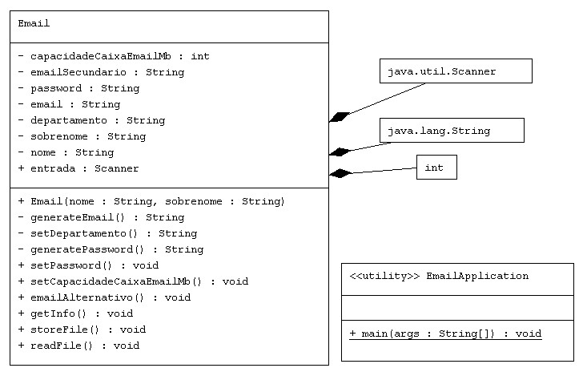

# Gerrador de email empresarial com Java puro

	  

  

Projeto de java orientado a objetos de um gerador de email empresarial, onde o usuario insere o o nome e o departamento, e são geradas
- senha aleatoria segura
- email completo com o domínio da empresa 

### Demo

  

### Módulos
- [x] alterar senha
- [x] inserir email secundário
- [x] gravar informaçoes em arquivo de texto
- [x] exibir informações
- [x] alterar caixa de entra

## Diagrama do código (UML Diagram)

  

-----------
## Licença de utilização

 
This work is licensed under a <a rel="license" href="http://creativecommons.org/licenses/by/4.0/">Creative Commons Attribution 4.0 International License</a>.

<!-- CONTACT -->
## Contato

  

  

  

**Author:** Jonas Araujo de Avila Campos

**Confira mais projetos: [AQUI](https://github.com/jonasaacampos)**
